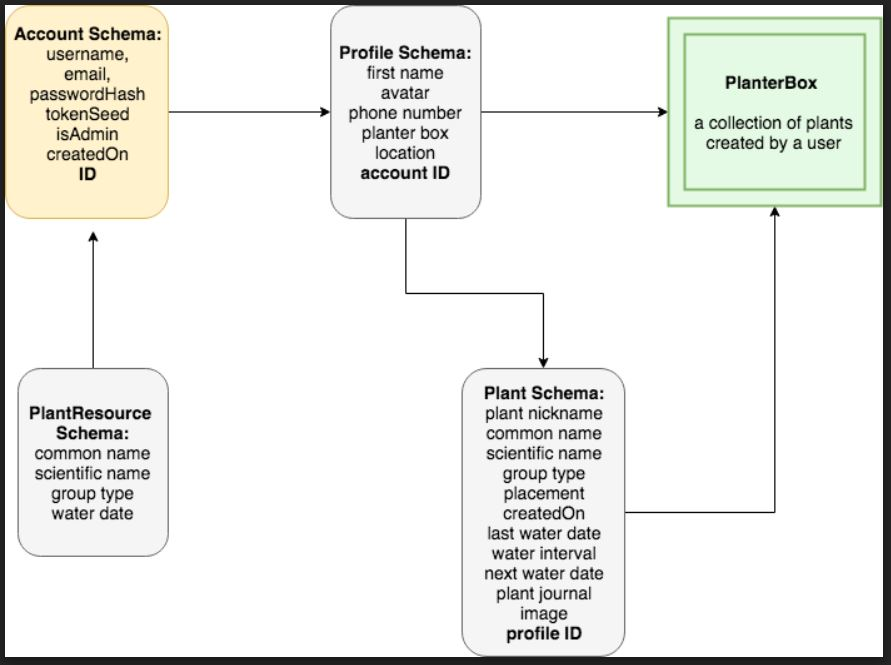

**```Author```**```: Daniel Shelton, Joanna Coll, Jennifer Piper, David Stoll```


## Overview
[](https://travis-ci.org/Bloomio/Bloomio-backend)
[](https://travis-ci.org/Bloomio/Bloomio-backend)
[](https://github.com/Bloomio/Bloomio-backend/network)
[](https://github.com/Bloomio/Bloomio-backend)
[](https://github.com/Bloomio/Bloomio-backend)
[](https://github.com/Bloomio/Bloomio-backend)

**```Version```**```: 1.0.0```

**Bloomio** is a calendar-assistant app designed to assist in caring for one's plants and also utilizes an extensive database of comprehensive plant-care directions. Users are able to specify their personal collections of plants they own and **Bloomio** will take care of notifying the user which plants are due for watering. 

# Getting Started

## Initialize Project
```
npm init -y
```
## Developer Dependencies
[](https://ForTheBadge.com)

```
npm i -D aws-sdk-mock babel-cli babel-eslint babel-preset-env babel-preset-stage-0 babel-register eslint eslint-config-airbnb-base eslint-plugin-import eslint-plugin-jest jest superagent winston@next
```
## Dependencies
```
npm i aws-sdk bcrypt body-parser crypto dotenv express faker fs-extra http-errors jsonwebtoken mongoose multer twilio mongodb 
```
# Project Design

# API routes

1. Account
  - POST /signup
     - success: returns 200 status code and an authorization token.
     - failure for bad request: returns 400 status code.
     - failure for duplicate key: returns 409 status code.
      
  - GET /login
     - success: returns 200 status code and access to user account.
     - PUT /accounts/:id
     - success: returns 200 status code and update selected field.
     - failure: returns 400 status code if profile not found or if new property is invalid.
         
  - DELETE /accounts/:id
     - success: returns 204 status code removes the account
     - failure returns 400 status code if no account found.
     - failure for duplicate key: returns 409 status code.
    
2. Profile
   - POST /profile
     - success: 200 and profile created
     - failure: 400 code if no token passed
     - failure: 401 code if invalid token was passed
     
   - GET /profile/:id
     - success: 200 and profile access
     - failure: 400 code if no token passed
     - failure: 401 code if invalid token passed
     - failure: 404 code for no id 
   - PUT /profile/:id
     - success: 200 and profile gets updated
     - failure: 400 code if no token passed
     - failure: 401 code if invalid token passed
     - failure: 404 code if bad id was passed 
     - failure: 409 code if duplicate keys were passed 
   - PUT /profile/avatar
     - success: 200 and profile picture gets uploaded
   - DELETE /profile/:id
     - success: 204 and profile gets removed
     - failure: 400 code if no account exist
     
3. Plant
   - POST /plant
     - success: 200 and returns the new plant
     - failure: 400 code if bad request
     - failure: 400 code if no token given
     - failure: 409 code if duplicate keys were passed
   - GET /plant/:id
     - success: 200 and returns the specified plant
     - failure: 400 code if no id given
     - failure: 404 code if missing token
   - PUT /plant/:id
     - success: 200 and return the updated plant
     - failure: 400 code if bad request   
   - DELETE /plant/:id
     - success: 204 and deletes the plant
     - failure: 400 code if no token being passed
     - failure: 401 code if invalid token
    
4. PlanterBox:
   - GET /profile/planterbox
     - success: 200 and user can access their collection of plants
     - failure: 400 code if no token passed
     - failure: 401 code if invalid token passed
     - failure: 404 code for no id 

# Version Release Schedule

## v 0.1.0
- 05-13-2018 2:53PM - Initial project scaffolding.
- 05-14-2018 10:30AM - Logger middleware added.
- 05-14-2018 10:40AM - Basic-auth middleware added.
- 05-14-2018 10:45AM - Bearer-auth middleware added.
- 05-14-2018 10:50AM - Error middleware added.
- 05-14-2018 10:55AM - S3 middleware added.
- 05-14-2018 11:00AM - Server and remaining dependencies added.
- 05-14-2018 11:40AM - Scaffolding finalized.
- 05-14-2018 1:04PM - Account Schema added.
- 05-14-2018 2:05PM - Profile Schema and Plant Schema added.
- 05-14-2018 4:05PM - Routes for Plant Schema finished.
- 05-14-2018 5:06PM - Profile GET route added.

## v 0.2.0

- 05-14-2018 8:32PM - Documentation reformatted.
- 05-14-2018 6:05PM - Tests for Plant Schema POST routes passing.
- 05-15-2018 9:44AM - Account PUT routes added/tests passing.
- 05-15-2018 10:04AM - Account DELETE routes added/tests passing.
- 05-15-2018 10:36AM - Profile 409 PUT test passing.
- 05-15-2018 11:30AM - Tests for Plant Schema GET and DELETE routes passing.
- 05-15-2018 01:36PM - PUT route for Plant Schema added and test passing.
- 05-15-2018 05:30PM - POST and GET route for plantBox are added and tested.


## v 0.3.0
- 05-16-2018 01:00PM - Updated plant Schema to store more details of watering schedule.
- 05-16-2018 01:00PM - Finished AWS to upload plant pictures.
- 05-16-2018 03:36PM - PlantResource Schema added and passing POST test.
- 05-16-2018 04:16PM - Function to create Date and calculate intervals created and tested
- 05-16-2018 04:30PM - Artillery tested.

## v 0.4.0

- 05-16-2018 6:36PM - GET route for PlantResource Schema created and tested.
- 05-17-2018 10:00AM - Readme updated.
- 05-17-2018 2:00PM - Artillery reports created.
- 05-17-2018 4:00PM - More tests added. Delete posthook fixed. Refactored PUT route to recalculate next water date when water interval is updated.
- 05-17-2018 4:30PM - Bloomio Graph ready.
- 05-17-2018 4:50PM - Twilio messages are being sent.


###LOAD TEST

```
HEROKU server

  "aggregate": {
    "timestamp": "2018-05-17T21:37:03.213Z",
    "scenariosCreated": 10010,
    "scenariosCompleted": 5578,
    "requestsCompleted": 15584,
    "latency": {
      "min": 76,
      "max": 31727,
      "median": 10051.8,
      "p95": 30411,
      "p99": 30646
    },
    "rps": {
      "count": 15588,
      "mean": 219.98
    },
    "scenarioDuration": {
      "min": 395.1,
      "max": 30960.4,
      "median": 12914.2,
      "p95": 29619.1,
      "p99": 30457.9
    },
    "scenarioCounts": {
      "Create Users": 10010
    },
    "errors": {
      "ENOTFOUND": 4
    },
    "codes": {
      "200": 11145,
      "409": 38,
      "503": 4401
    },
    "matches": 0,
    "customStats": {},
    "phases": [
      {
        "duration": 1,
        "arrivalRate": 10
      },
      {
        "duration": 10,
        "arrivalRate": 1000
      }
    ]
  },
  ```
 
 ``` 
LOCAL HOST

  "aggregate": {
      "timestamp": "2018-05-17T21:40:22.561Z",
      "scenariosCreated": 10010,
      "scenariosCompleted": 9943,
      "requestsCompleted": 19890,
      "latency": {
        "min": 1.7,
        "max": 52406.5,
        "median": 1166.9,
        "p95": 48040.3,
        "p99": 51477
      },
      "rps": {
        "count": 19953,
        "mean": 270.55
      },
      "scenarioDuration": {
        "min": 26,
        "max": 52427.6,
        "median": 29786.8,
        "p95": 50535.2,
        "p99": 52005
      },
      "scenarioCounts": {
        "Create Users": 10010
      },
      "errors": {
        "ECONNRESET": 63
      },
      "codes": {
        "200": 19879,
        "409": 11
      },
      "matches": 0,
      "customStats": {},
      "phases": [
        {
          "duration": 1,
          "arrivalRate": 10
        },
        {
          "duration": 10,
          "arrivalRate": 1000
        }
      ]
    },
    ```


```

    LOCAL HOST median under 20ms
    
    "timestamp": "2018-05-17T21:41:46.330Z",
    "scenariosCreated": 30,
    "scenariosCompleted": 30,
    "requestsCompleted": 60,
    "latency": {
      "min": 2.9,
      "max": 69.2,
      "median": 19.5,
      "p95": 28.6,
      "p99": 66.8 
    },
    "rps": {
      "count": 60,
      "mean": 25.21
    },
    "scenarioDuration": {
      "min": 24.7,
      "max": 126.3,
      "median": 26.3,
      "p95": 52.5,
      "p99": null
    },
    "scenarioCounts": {
      "Create Users": 30
    },
    "errors": {},
    "codes": {
      "200": 60
    },
    "matches": 0,
    "customStats": {},
    "phases": [
      {
        "duration": 1,
        "arrivalRate": 10
      },
      {
        "duration": 1,
        "arrivalRate": 20
      }
    ]

# Credits and Collaborations
A special thanks to our TA Nicole Weese for her assistance in incorporating Twilio into our project.