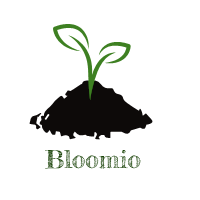

[](https://travis-ci.org/Bloomio/Bloomio-backend)
[](https://travis-ci.org/Bloomio/Bloomio-backend)
[](https://github.com/Bloomio/Bloomio-backend/network)
[](https://travis-ci.org/Bloomio/Bloomio-backend.svg?branch=master)
[](https://lbesson.mit-license.org/)

[](https://coveralls.io/github/CityOfZion/neon-wallet?branch=staging)


**```Author```**```: Daniel Shelton, Joanna Coll, Jennifer Piper, David Stoll```

**Version**: 1.0.0




# Overview
**Bloomio** is a calendar-assistant app designed to assist in caring for one's plants and also utilizes an extensive database of comprehensive plant-care directions. Users are able to specify their personal collections of plants they own and **Bloomio** will take care of notifying the user which plants are due for watering. 

# Getting Started

## Initialize Project
```
npm init -y
```
## Developer Dependencies
[](http://ForTheBadge.com)

```
npm i -D aws-sdk-mock babel-cli babel-eslint babel-preset-env babel-preset-stage-0 babel-register eslint eslint-config-airbnb-base eslint-plugin-import eslint-plugin-jest jest superagent winston@next
```
## Dependencies
```
npm i aws-sdk bcrypt body-parser crypto dotenv express faker fs-extra http-errors jsonwebtoken mongoose multer twilio mongodb 
```

# API routes
  1. Account
    - POST /signup
      - success: returns 200 status code and an authorization token.
      - failure for bad request: returns 400 status code.
      - failure for duplicate key: returns 409 status code.
  2. Profile
    - POST /profile
     - success:
    - GET /profile/:id
  3. Plant
    - POST /plant
    - GET /plant/:id
    - PUT /plant/id

# Version Release Schedule

## v 1.0.0
- 05-13-2018 2:53PM - Initial project scaffolding.
- 05-14-2018 10:30AM - Logger middleware added.
- 05-14-2018 10:40AM - Basic-auth middleware added.
- 05-14-2018 10:45AM - Bearer-auth middleware added.
- 05-14-2018 10:50AM - Error middleware added.
- 05-14-2018 10:55AM - S3 middleware added.
- 05-14-2018 11:00AM - Server and remaining dependencies added.
- 05-14-2018 11:40AM - Scaffolding finalized.

## v 1.1.0
- 05-14-2018 1:04PM - Account Schema added.
- 05-14-2018 2:05PM - Profile Schema and Plant Schema added.
- 05-14-2018 4:05PM - Routes for Plant Schema finished.
- 05-14-2018 5:06PM - Profile GET route added.
- 05-14-2018 8:32PM - Documentation reformatted.
- 05-14-2018 4:05PM - Tests for Plant Schema POST routes passing.
- 05-14-2018 9:44PM - Account PUT routes added/tests passing.
- 05-14-2018 10:04PM - Account DELETE routes added/tests passing.
- 05-14-2018 10:36PM - Profile 409 PUT test passing.
- 05-15-2018 11:30AM - Tests for Plant Schema GET and DELETE routes passing.
- 05-14-2018 01:36PM - PUT route for Plant Schema added and test passing.
- 05-15-2018 05:30PM - POST and GET route for plantBox are added and tested.
- 05-15-2018 01:36PM -
- 05-15-2018 01:36PM -
- 05-15-2018 01:36PM - 
